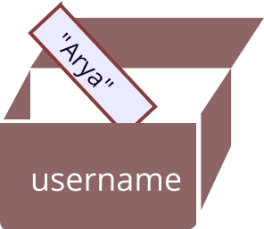
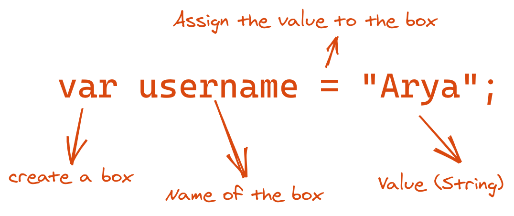
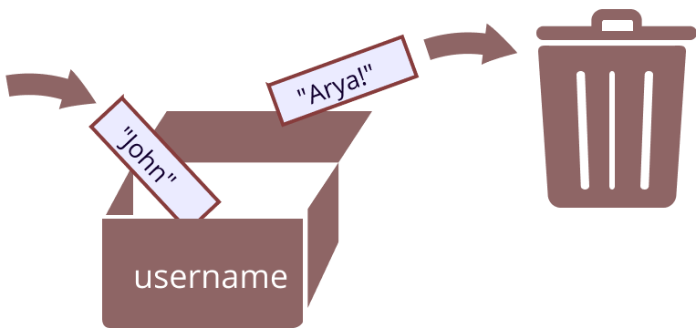
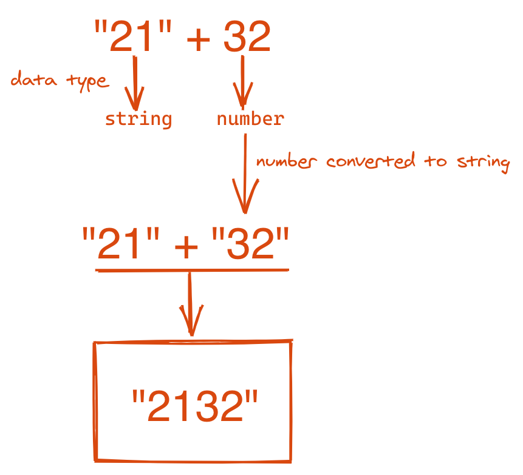

## What is Value-readText

The most fundamental unit of information in programming is called value or data. It can be any piece of information like your name or age.

For example

`name` can be `"Arya"` or `age` can be `23`.

`"Arya"` and `23` in programming terms are called values.

You can have different kind of values a letter, word, paragraph, number etc. These values are divided into different types also know `Data Types` or you can call it value types. All the value has to be one of the following types.

### Data Types

1. Number (`21`, `21.45` )
2. String (`"a"`, `"hello"`, `"A quick brown fox jumped over lazy dog!"`)
3. Boolean (`true`, `false`)
4. `null`
5. `undefined`
6. Object

Latest addition to JavaScript family:

7. **Symbol**
8. **BigInt**

#### Number

All numeric values are of `number` data type in JavaScript. Example of number type would be

```js
133,
  1,
  456 - 123, // Integers
  -324; // Negative Numbers
132.43, -12.23; // Decimal point number
Infinity, NaN, -Infinity; // Special numbers like
```

**JavaScript uses a fixer number of bits i.e `64` to store a single number.**

Special numbers are values that are of number data type but doesn't exactly behaves like numbers in some cases.

```js
Infinity - 1; // Infinity
```

Numbers can manipulated using arithmetic operations like addition, multiplication etc. To do that we use arithmetic operators (`+`, `-`, `*`).

```js
24 + 21; // 45
45 - 20; // 25
30 * 20; // 600
20 + 10 * 11; // 130
```

Symbols like (`+`, `-`, `*`) used above are called Operators. Putting the operator between two values will return a new value. Like in above example using `+` on 24 and 21 return 45.

---

#### BigInt

Used to represent the number bigger than 9007199254740991 or smaller than -9007199254740991. For BigInt you need to add `n` at the end of the value.

```js
const bigInt = 1234567890123456789012345678901234567890n;
```

---

#### String

Any representation of text is `string` data type in JavaScript.

Example:

```js
"a"; // letter
"A"; // uppercase letter
"Hello"; // word
"Hello World!"; // single quote
"JavaScript is a single threaded language!"; // paragraph
```

**Visual Impression to identify string:** Anything wrapped in `''` , `""` or `backticks` is a string.

---

#### Boolean

To differentiate between only two possible values like `day` or `night` , `yes` or `no` , `on` or `off` we use boolean data type in JavaScript that has only two fixed values `true` or `false`.

- `true` can represent values like `on` or `yes`

- `false` represents values like `off` or `no`

---

#### Void Values (Empty)

To represent the existence of no meaningful values we use special values i.e `null` or `undefined`. These are values that carry no informations. It is used for the places where the operation doesn't produce meaningful value.

`undefined` is the only value of type undefined `null` is the only value of type null

There is no fundamental difference between `null` or `undefined`. In most of the case you can treat the as interchangeable.

---

### `typeof`

To check the data type of any value we use `typeof` operator. It always return `string` data types.

```js
typeof 21; // "number"
typeof "Hello"; // "string"
typeof true; // "boolean"
typeof undefined; // "undefined"
typeof null; // "object" 🔥Boop
```

`typeof null` returns `"object"` is a bug in JavaScript. It can't be fixed ever because there are lots of website depends on this error.

## Variable (Storing a value)-readText

In the above module we learned about value (information) and different value types like `number` , `string` , `boolean` etc.

Variable is a named storage that is used to store any value. You can imagine a variable to be like a box with name that is used to store number, boolean, string, null, undefined, object, BigInt and Symbol.

Example:

```js
var username = "Arya";
```

In the above code we are using multiple things let's understand all of those.

- `var` Keyword to create a new box.

- `username` To name a box.

- `=` assignment operator assign a value `"Arya"` to the box named `username`





**On the right hand side of `=` can only be a value.**

You can also change the value of a variable using `=` (assignment operator) like below

```js
var username = "Arya";
username = "John";
```

The value of the `"Arya"` will be replaced with `"John"` this is called re-assignment.



variable can only hold one value at a time.

There are multiple ways of creating a box in JavaScript i.e `var` , `let`, `const`

```js
var username = "Arya";
let house = "Stark";
const brother = "John";
```

You can create boxes using multiple ways but all the boxes behaves differently.

### `var`

### `let`

### `const`

Box created with const keyword can't be re-assigned to another value.

## Predefined Utilities-readText

### `alert`, `prompt`, `confirm`, `console`

There are few predefined functions present in browser to help us interact with user and also to help us with debugging. These functions can be executed with `()` after the function name in browser using developer tool `console`

#### `alert`

It accepts a message in string data type. This will open a dialog box in the browser with `ok` button.

The job of the alert function is to display a dialog box with any message you pass in the browser.

```js
alert("Hello World!");
```

#### `prompt`

It accepts a string data type and display with an input box where user can enter value in the browser. `prompt` returns the data entered by user in the string data type.

```js
propmt("What is your age?"); // "21"
```

#### `confirm`

It shows a modal window in the browser with two buttons i.e `ok` and `cancel` . It returns `true` if your click `ok` or `false` if you click `cancel`

```js
confirm("Do you want to close is?"); // true
```

## Type Conversion - readText

It is a mechanism of converting one data type to another data type.

Example:

```js
"21" + 23; // "2123"
```



There are two type of type conversion that happens

1. Implicit
2. Explicit

### Implicit

Implicit type conversion refers to JavaScript engine's attempt to convert unexpected value type to expected value type like in above example the value `32` got converted into `"32"` to complete the operation. The system does this kind of conversion.

    true + true; // 2 (boolean to number)
    1 + "2" + 21; // "1221" (number to string)
    1 + true; // 2 (boolean to number)
    3 * "3"; // 9 (string to number)

### Explicit

Explicit type conversion is we as developer convert unexpected data type into expected data type.

You can use these functions to convert to respective types i.e `Number()`, `String()`, `Boolean()` etc.

```js
Number(true); // 1 (boolean to number)
Number("1"); // 1 (string to number)
Number(null); // 0 (null to number)
Number(undefined); // 0 (undefined to number)
String(21); // "21" (number to string)
String(true); // "true" (boolean to string)
```

You can also convert a non number data type into number using _unary_ `+` operator like `+"21"` will return 21.

### Truthy and Falsy Values

All the values in JavaScript can be categorised into one of two kinds of values either `truthy` or `falsy` values.

When you convert a value into boolean and you get `true` as result that value is said to a truthy value.

```js
Boolean(36); // true (36 is a truthy value)
Boolean("Hello"); // true ("Hello" is a truthy value)
Boolean({}); // true ({} is a truthy value)
```

Similarly when converting a value into boolean returns `false` as result that value is considered to be falsy value. There are only six values that are falsy.

1. `false`
2. `0`
3. `""` (empty string)
4. `null`
5. `undefined`
6. `NaN`
7. `-0`

**Everything else is truthy.**

```js
Boolean(null); // flasy value
Boolean(undefined); // flasy value
Boolean(0); // flasy value
Boolean(false); // flasy value
Boolean(""); // flasy value
Boolean(NaN); // flasy value
Boolean(false); // flasy value
```

**All the values other than six falsy values are truthy values.**

**NOTE**: `true` is a value truthy is a kind of value. `36`, `"Hello"` are truthy values.
